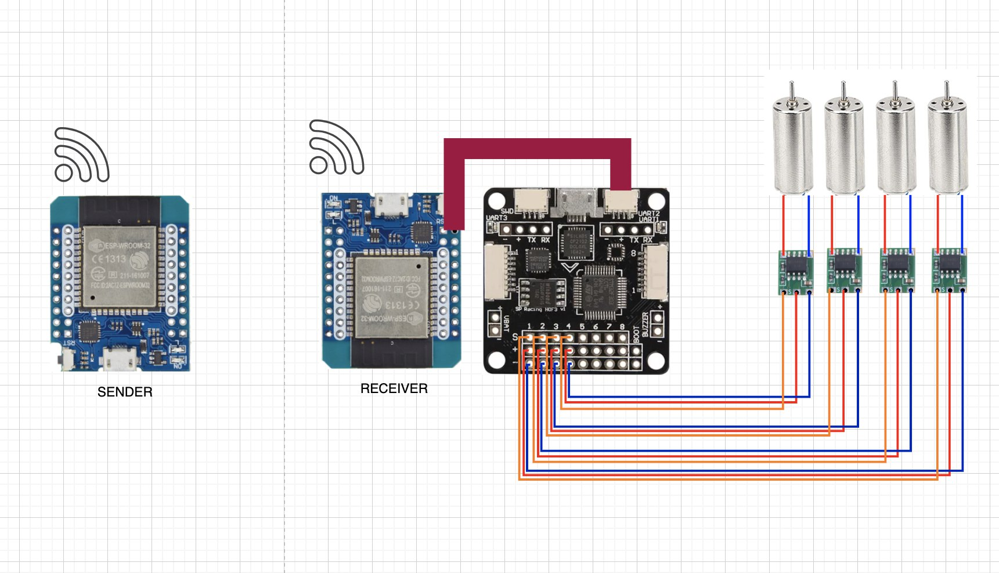

# Mini Drone Project

This repository contains the code and documentation for a mini drone project using brushed motors and an ESP32-based control system.

## Project Overview

The mini drone uses the following key components:
- 4 brushed motors for propulsion
- A flight controller to manage motor control and stabilization
- An ESP32 module that emulates an RC receiver, interfacing with the flight controller
- A ground station, also using an ESP32, that receives input from a the serial port of the laptop
- A laptop that sends joystick signals to the ground station ESP32 via serial port using a simple GUI

## System Architecture

1. **Input**: HUI Joystick connected to a laptop
2. **Ground Station**: ESP32 module receiving signals from the laptop via serial port
3. **Airborne Receiver**: Another ESP32 module that receives signals from the ground station
4. **Flight Controller**: Receives signals from the airborne ESP32 and controls the motors
5. **Motors**: 4 brushed motors for drone propulsion

## Components

| Component | Quantity | Price (USD) | Link |
|-----------|----------|-------------|------|
| Brushed Motors, frame and propellers | 4 | €14.00 | [Link](https://www.aliexpress.com/item/32776829828.html?spm=a2g0o.order_list.order_list_main.166.218f3696a4j7cG) |
| Flight Controller | 1 | €16.00| [Link](https://www.aliexpress.com/item/1005005253184101.html?spm=a2g0o.order_list.order_list_main.152.218f3696a4j7cG) |
| Brushed ESC | 4 | €5.00 | [Link](https://it.aliexpress.com/item/1005007060330812.html?spm=a2g0o.order_list.order_list_main.131.218f3696a4j7cG&gatewayAdapt=glo2ita)] |
| ESP32 Module | 2 | €6.00 | [Link](https://www.aliexpress.com/item/32858054775.html?spm=a2g0o.order_list.order_list_main.147.218f3696a4j7cG) |
| Battery | 1 | €7.00 | [Link](https://www.amazon.de/-/en/dp/B07KWDPP7W) |
| Battery holder | 1 | €2.00 | [Link](https://www.aliexpress.com/item/1005001346705221.html?spm=a2g0o.order_list.order_list_main.156.218f3696a4j7cG) |

**Total Cost: €50.00**

## Circuit Diagram

## Setup and Usage

1. **Ground Station Setup**:
   - Connect the first esp32 to the laptop and upload the sender code to it

2. **Drone Setup**:
   - Assemble the drone frame with motors and flight controller
   - Upload the receiver code to the drone's ESP32 module
   - Connect the ESP32 to the flight controller through the UART port

3. **Operation**:
   - Run the code Joystick_serial to stat the communication and the joystick UI
   - Power on the drone
   - Use the Keyboard to control the drone

## Contributing

We welcome contributions to this project! Please read our contributing guidelines before submitting pull requests.

## License

This project is licensed under the [MIT License](LICENSE).

## Future Objectives

While this project currently focuses on manual control via a joystick, our long-term objective is to make the drone autonomous. Future development will involve implementing features such as:

- Sensor integration for environmental awareness
- Path planning algorithms
- Obstacle avoidance systems
- Autonomous takeoff and landing capabilities
- Mission planning and execution
